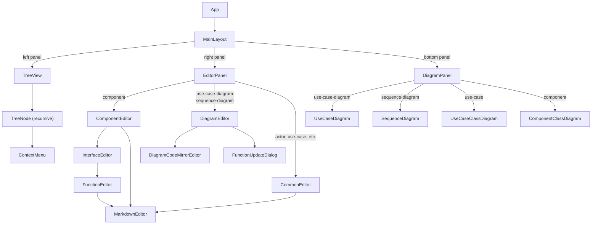
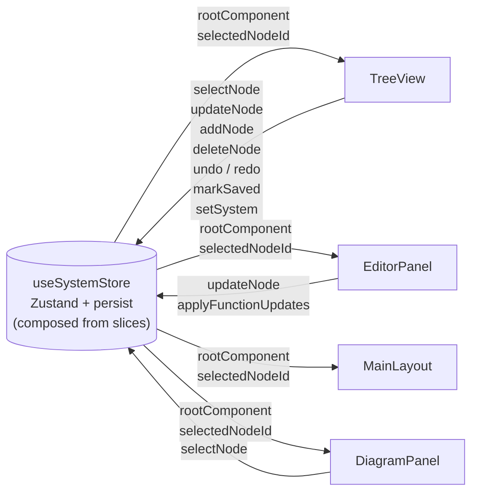

# Integra

A visual editor for system engineering models using diagram specifications.

---

## For Users

### Quick Start

#### 1. Install and run

```bash
npm install
npm run dev
```

Open [http://localhost:5173](http://localhost:5173) in your browser.

#### 2. Save and load your model

Use the **Save** / **Load** buttons in the toolbar to persist your model as a **directory of YAML files** via the browser's File System Access API. Each component is saved as its own `.yaml` file inside a chosen directory. Changes are also auto-saved to `localStorage` and restored on page load.

> **Browser support:** Save/Load requires Chrome or Edge (File System Access API). Firefox and Safari are not supported.

#### 3. Build your system model

The left panel shows your **system tree**. Start by renaming the root component, then add sub-components, use case diagrams, and sequence diagrams using the **+** buttons on each node. When you select a node, the right panel lets you edit its title inline at the top of the panel and its ID directly underneath.

#### 4. Write diagram specifications

Select a diagram node to open its specification editor. Type your spec in the text area — the right panel renders the diagram in real time. Syntax is highlighted as you type.

#### 5. Explore the derived model

As you write sequence diagrams, Integra automatically derives:
- **Actors and components** added to the owning component
- **Interface specifications** (with typed functions and parameters) on the receiving component
- **Use cases** listed under their use case diagram
- **Use-case class diagram** — when a use-case node is selected, the bottom panel renders an auto-generated class diagram showing the actors, components, and interfaces used across its sequence diagrams, with realization (`..|>`) and dependency (`..>`) arrows. Dependency extraction follows referenced `Sequence:` diagrams and referenced `UseCase:` diagrams transitively, deduplicates repeated reachable diagrams, and stops safely on circular references.
- **Component class diagram** — when a component node is selected, the bottom panel renders an auto-generated class diagram showing the component's interfaces, immediate sibling actors/components that call those interfaces, rolled-up direct-child participants when nested sub-components create dependencies, sibling components of ancestor components that participate in inbound or outbound dependencies, and the dependency interfaces plus owner components that this component calls out to, even when the selected component has no interfaces of its own. When a nested component depends on an ancestor sibling, that ancestor sibling's own diagram rolls the inbound dependent up to the sibling ancestor component rather than the nested caller. Inbound dependencies from ancestor siblings are highlighted in red on the violating caller node as a visible constraint violation. Inherited interfaces resolve their function signatures from the parent interface, and for any interface shown in the diagram only the functions that are actually referenced by the relevant sequence diagrams are listed. Dependency extraction also follows referenced `Sequence:` diagrams and referenced `UseCase:` diagrams transitively, with deduplication and cycle protection. When the root component is selected, the generated diagram still stays at the root-child level, but nested descendant calls can roll up into dependencies between direct root children and participating root actors.

Navigate the tree to inspect generated nodes. Clicking a node or participant in the rendered diagram navigates to that node in the tree. Hovering a dependency link in a generated class diagram shows the sequence diagrams that derived that dependency; clicking a multi-source dependency keeps that popup available for selection, while clicking a single-source dependency navigates directly to that sequence diagram. Orphaned nodes (no longer referenced by any diagram) show a delete button on hover.

---

### Editor Features

#### Autocomplete

The diagram spec editor provides context-aware suggestions as you type:
- **Participants**: suggest known actors and components when typing after `actor`, `component`, or `from`; descendants of the owning component are suggested with a **relative path** (e.g. `grandchild` or `child/grandchild`), while cross-tree references use an **absolute path** with an alias (e.g. `root/services/auth as auth`)
- **Message receivers**: suggest participants when typing the receiver in a message line
- **UseCase targets**: suggest use case IDs after `UseCase:` in a message label; for use cases in other components the suggestion includes the full path (e.g. `UseCase:orders/placeOrder`)

Suggestions appear automatically as you type. They reflect nodes already defined in the current component (local-first ordering). Accept with `Enter`, dismiss with `Escape`.

#### Keyboard Shortcuts

| Shortcut | Action |
|---|---|
| `Shift+Enter` | Save spec and preview diagram without leaving edit mode |
| `Cmd/Ctrl+Z` | Undo in the diagram spec editor (CodeMirror history) *or* tree-level |
| `Cmd/Ctrl+Shift+Z` / `Cmd/Ctrl+Y` | Redo |
| `Alt+←` | Navigate back to the previously selected tree node |
| `Alt+→` | Navigate forward (after going back) |

Tree-level undo/redo is also accessible via the toolbar buttons above the system tree.
The diagram spec editor uses CodeMirror's built-in history, fully independent from the tree-level history.

#### Node Navigation History

The toolbar above the system tree includes **← Back** and **→ Forward** buttons (before Undo/Redo). These work like browser navigation — clicking any node in the tree adds it to the history, and you can step backwards and forwards through your recent selections. The history is per-session and is not persisted across page reloads.

When navigation happens from a rendered diagram or a markdown node link, the
tree automatically expands the newly selected node's ancestor chain and scrolls
that node into view.

#### Description editing

Node descriptions open in a **preview-first** mode. The selected node shows its
rendered markdown immediately, without a separate description label or markdown
toolbar. Click the description area to switch into the full markdown editor;
when the description is empty, the preview shows a compact **No Description**
placeholder until you enter edit mode.

#### Panel Layout

The split-panel layout can be adjusted by dragging the resize handles. Use the **›** button on the right-panel handle to expand/collapse the right panel.

---

### Interface Inheritance

A sub-component can declare that one of its interfaces **inherits** a parent component's interface. This means the sub-component's interface shares the same contract (functions and types) as the parent interface, sourced live from the parent rather than duplicated.

#### Setting up inheritance

1. Select a sub-component in the tree.
2. If its parent component defines interfaces, an **"Inherit parent interface:"** selector appears above the interface tabs.
3. The dropdown lists all parent interfaces not yet inherited by this component. Select one to create a new inherited interface entry and activate its tab.

#### Inherited interface behaviour

- The inherited interface tab is **fully read-only** — name, type, ID, description, and functions are all locked and reflect the parent interface's values.
- Component and root class diagrams also use those inherited parent functions when rendering the inherited interface.
- A badge shows which parent interface is being inherited (e.g. `inherited from IPaymentGateway`).
- To remove the inheritance, click the **delete** button on the inherited interface tab.
- Sequence diagrams **cannot add new functions** to an inherited interface. Parsing a `receiver: InheritedIface:newFn()` call that isn't already defined on the parent interface raises a parse error.

#### Warning icon

When a parent component's interface has no sub-component inheriting it, a **⚠** warning icon appears on the interface tab with the tooltip *"No sub-component inherits this interface"*. This is purely informational — it highlights interfaces that may be intended for inheritance but haven't been wired up yet.

---

### Diagram Specifications

#### Use Case Diagram

Declare actors, use cases, and their relationships.

```
# Local nodes (created in the owning component)
actor customer
use case login
use case placeOrder

# External node — reference an existing node by path
component root/admin as admin

# Relationships
customer ->> login
customer ->> placeOrder
admin ->> placeOrder
```

| Syntax | Purpose |
|---|---|
| `actor id` | Declare a local actor |
| `actor id as alias` | Declare a local actor; use `alias` in relationship lines |
| `use case id` | Declare a use case |
| `component path/to/node` | Reference an existing component by path (no new node created) |
| `component path/to/node as alias` | Reference with an alias |
| `A ->> B` | Relationship arrow (default — maps to `-->` in Mermaid) |
| `A ->> B: label` | Relationship arrow with a link label |

**Arrow types** — the arrow between two nodes maps directly to Mermaid flowchart syntax:

| Arrow | Mermaid meaning |
|---|---|
| `->>` | Arrowhead (**default**, backward-compatible — renders as `-->`) |
| `-->` | Arrowhead |
| `---` | Open link, no arrowhead |
| `--o` | Circle at end |
| `--x` | Cross/X at end |
| `<-->` | Bidirectional arrow |
| `o--o` | Bidirectional circle |
| `x--x` | Bidirectional cross |
| `-.->` | Dotted arrow |
| `-.-` | Dotted open link |
| `==>` | Thick arrow |
| `===` | Thick open link |
| `~~~` | Invisible link |

**Link labels** — append `: label text` to add a label displayed on the link:

```
customer ->> login: initiates
admin --o placeOrder: extends
customer <--> admin: interacts with
```

**Node IDs are scoped to the owning component.** The same ID can be reused in different components.

---

#### Sequence Diagram

Declare participants and message interactions.

```
# Local participants
actor customer
component orderSvc
component paymentSvc

# External component referenced by path
component root/services/auth as auth

customer ->> orderSvc: OrdersAPI:placeOrder(orderId: string, amount: number)
orderSvc ->> paymentSvc: PaymentsAPI:charge(orderId: string, amount: number, currency: string?)
orderSvc ->> customer: UseCase:orderConfirmed
orderSvc ->> customer: UseCase:orderService/orderConfirmed
orderSvc ->> customer: UseCase:root/orders/orderConfirmed:Order confirmed
orderSvc ->> customer: Sequence:orderConfirmedFlow
orderSvc ->> customer: Sequence:auth/loginFlow:Log In

note right of customer: initiates the flow
note over orderSvc, paymentSvc: payment handshake
```

| Syntax | Purpose |
|---|---|
| `# comment text` | Line comment — ignored by the parser; preserved through ID rename |
| `actor id` | Declare a local actor participant |
| `actor id as alias` | Declare a local actor; use `alias` in message lines |
| `component id` | Declare a local component participant |
| `component path/to/node` | Reference an existing component by path (no new node created) |
| `component path/to/node as alias` | Reference with an alias |
| `sender ->> receiver: Interface:function(param: type)` | Function call message — derives interface on receiver |
| `sender ->> receiver: Interface:function(param: type):display label` | Function call message with a custom display label (diagram shows only the label) |
| `sender ->> receiver: label text` | Plain message label |
| `sender ->> receiver` | Bare arrow (no label) |
| `sender ->> receiver: UseCase:useCaseId` | Use case reference (local — receiver's component) |
| `sender ->> receiver: UseCase:comp/useCaseId` | Use case reference by path (relative or absolute) |
| `sender ->> receiver: UseCase:useCaseId:label` | Use case reference with a custom display label |
| `sender ->> receiver: UseCase:comp/useCaseId:label` | Use case path reference with a custom label |
| `sender ->> receiver: Sequence:seqDiagramId` | Sequence diagram reference (local — receiver's component) |
| `sender ->> receiver: Sequence:comp/seqDiagramId` | Sequence diagram reference by path |
| `sender ->> receiver: Sequence:seqDiagramId:label` | Sequence diagram reference with a custom display label |
| `note right of id: text` | Note to the right of a participant |
| `note left of id: text` | Note to the left of a participant |
| `note over id: text` | Note spanning a single participant |
| `note over id1, id2: text` | Note spanning two participants |
| `loop [condition]` … `end` | Loop block (renders as Mermaid `loop`) |
| `alt [condition]` … `else [condition]` … `end` | Conditional block (renders as Mermaid `alt`/`else`) |
| `opt [condition]` … `end` | Optional block — single section, no `else` (renders as Mermaid `opt`) |
| `par [label]` … `and [label]` … `end` | Parallel block (renders as Mermaid `par`/`and`) |

**Arrow types** — the arrow between sender and receiver maps 1:1 to Mermaid's sequence diagram arrow syntax:

| Arrow | Mermaid meaning |
|---|---|
| `->>` | Solid line, arrowhead — synchronous call (**default**) |
| `-->>` | Dotted line, arrowhead — reply or async |
| `->` | Solid line, no arrowhead |
| `-->` | Dotted line, no arrowhead |
| `-x` | Solid line, X — destroy |
| `--x` | Dotted line, X |
| `-)` | Solid line, open arrowhead — async notation |
| `--)` | Dotted line, open arrowhead |

Example:
```
client ->> server: REST:getUser(id: string)
server -->> client: response
```

**Block constructs** — `loop`, `alt`, `opt`, and `par` wrap sequences of messages. Condition/label text after the keyword is optional free-form text. Blocks are fully nestable.

```
loop check every second
  A ->> B: ping
end

alt happy path
  A ->> B: ok
else error path
  A ->> B: err
else
  A ->> B: default
end

opt if user is premium
  A ->> B: upgrade offer
end

par send notification
  A ->> B: notify
and update audit log
  A ->> C: log
end
```

- `else` sections apply only to `alt` blocks; `and` sections apply only to `par` blocks; `opt` has no sections.
- `end`, `else`, `and`, and `opt` are reserved keywords and cannot be used as participant IDs.
- `UseCase:` and `Sequence:` path targets follow the same component scope rules as `component path/to/node` declarations: the target component must be the owner, a descendant, an ancestor, or a direct child of an ancestor. A use case or sequence diagram under a cousin component is out of scope and causes a parse error.

**Function call message format:** `sender ->> receiver: InterfaceId:functionId(param: type, param2: type?)`
- Parameter types default to `any` if omitted
- Append `?` to mark a parameter as optional (e.g. `name: string?`)
- Append `:display label` after the closing `)` to show a custom label in the diagram instead of `Interface:function(params)` (e.g. `IAuth:login(user: string):sign in`)
- For `kafka`-type interfaces, the **sender** owns the interface
- Use `\n` in a label or note text for a line break (renders as `<br/>` in Mermaid)

**Round-trip fidelity:** When a participant ID is renamed (e.g. via the rename action in the tree), the spec is re-generated from the AST. Line indentation (leading spaces and tabs inside blocks) and `#` comment lines are stored in the AST and reproduced verbatim — the only normalisation is that blank lines between statements are not preserved.

**Multi-word participant names** are supported — declare as `actor Output Topics` and reference the same name in messages.

**Self-reference:** A `component` participant with the same ID as the owning component is treated as a self-reference — no child component is created.

---

### Cross-Component References

Use a path to reference nodes defined in other parts of the tree. The path is a `/`-separated list of component IDs ending with the node ID:

```
# In a use case diagram — reference external component
component root/services/auth as auth

# In a sequence diagram — reference external component with alias
component root/services/payments as pay
customer ->> auth: AuthAPI:login(user: string)
customer ->> pay: PaymentsAPI:charge(amount: number)
```

When a path reference is used:
- If the terminal node does not yet exist it is **auto-created** (as a component), provided the path is in scope — intermediate missing components are also created automatically
- The node's UUID is recorded in `referencedNodeIds`; the node cannot be deleted while this reference exists
- The alias (if provided with `as alias`) is used in all message lines; otherwise the last path segment is used

**Single-segment declarations** (`actor id`, `component id`) always create or reference a **local** node within the owning component. Use a multi-segment path (`component root/services/auth`) to reach nodes elsewhere in the tree.

#### Reference scope

Multi-segment path references are restricted to components that are **in scope** for the owning diagram. A component `X` is in scope when it is:

| Relationship to ownerComp | Example (ownerComp = `child`) | Allowed |
|---|---|---|
| **Self** | `child` | ✅ |
| **Direct child** | `child/grandchild` | ✅ |
| **Ancestor** (parent, grandparent, …) | `root` | ✅ |
| **Sibling** (direct child of parent) | `root/sibling` | ✅ |
| **Uncle/Aunt** (direct child of grandparent) | `root/grandparent/uncle` — resolved as `uncle` | ✅ |
| **Any descendant** (grandchild, great-grandchild, …) | `grandchild`, `grandchild/greatGrandchild` | ✅ |
| **Cousin** (child of sibling/uncle) | `root/sibling/cousin` | ❌ |

```
root
  child     ← ownerComp
    grandchild        # descendant of owner — ✅
      greatGrandchild # descendant of owner — ✅
  sibling             # direct child of ancestor root — ✅
    cousin            # child of sibling — ❌
```

Referencing an out-of-scope path causes a parse error and the diagram spec is not applied.

For sequence-diagram message labels that use `UseCase:...` or `Sequence:...`, the same scope rule applies with one extra restriction: when the owning sequence diagram belongs to the **root** component, path-based references may target only the root component itself or components owned **directly under root**. Nested descendants under a root child are out of scope.

---

### Markdown Descriptions

All description fields support Markdown. In preview mode, write links to other nodes using their tree path:

```markdown
See also [Login Flow](loginFlow)                          <!-- same component, bare id -->
See also [Auth Service](services/auth)                    <!-- cross-component path -->
See also [Login Use Case](services/auth/mainDiag/login)   <!-- deep path -->
```

Clicking a node link navigates to that node in the tree.

---

### YAML File Format

Integra saves and loads your model as a **directory of YAML files** — one file per component. The directory can be read, authored, or version-controlled by hand.

#### Directory layout

When you save a system whose root component has id `my-system`, you get:

```
my-system.yaml              ← root component (the load/save entry point)
my-system/
  my-system-gateway.yaml    ← direct child of root (parent-id: my-system)
  gateway-auth.yaml         ← child of gateway (parent-id: gateway)
  gateway-payments.yaml     ← another child of gateway
```

- The **root file** is `<root-id>.yaml` in the chosen directory.
- **Descendant files** live in a flat `<root-id>/` subdirectory named `<parent-id>-<self-id>.yaml`.
- The `subComponents` field in each file lists the **relative paths** of its children (relative to the chosen directory root), instead of inlining the child data.

#### Top-level structure

Each component YAML file has the following shape:

```yaml
uuid: <globally-unique-id>
id: my-system               # must be "root" for the root component
name: My System
type: component
description: Optional description   # supports Markdown
subComponents:
  - my-system/my-system-gateway.yaml   # relative path to child file
actors: [...]
useCaseDiagrams: [...]
interfaces: [...]
```

#### Node type fields

| Node type | Key fields (beyond `uuid`, `id`, `name`, `type`, `description`) |
|---|---|
| `component` | `subComponents[]` (file paths), `actors[]`, `useCaseDiagrams[]`, `interfaces[]` |
| `actor` | *(none)* |
| `use-case-diagram` | `content` (spec text), `useCases[]` |
| `use-case` | `sequenceDiagrams[]` |
| `sequence-diagram` | `content` (spec text) |

> All diagram types (`use-case-diagram` and `sequence-diagram`) support the `description` field.

Interface specifications live directly on their owning component:

| Object | Key fields |
|---|---|
| `InterfaceSpecification` | `uuid`, `id`, `name`, `type` (`rest`\|`kafka`\|`graphql`\|`other`), `functions[]` |
| `InterfaceFunction` | `uuid`, `id`, `description?`, `parameters[]` |
| `Parameter` | `name`, `type`, `required` (boolean), `description?` |

#### Example

Root file — `e-commerce.yaml`:

```yaml
uuid: a1b2c3d4-0001
id: e-commerce
name: E-Commerce System
type: component
subComponents:
  - e-commerce/e-commerce-orderSvc.yaml
actors:
  - uuid: a1b2c3d4-0020
    id: customer
    name: Customer
    type: actor
useCaseDiagrams:
  - uuid: a1b2c3d4-0030
    id: mainFlows
    name: Main Flows
    type: use-case-diagram
    content: |
      actor customer
      use case placeOrder
      customer ->> placeOrder
    useCases:
      - uuid: a1b2c3d4-0031
        id: placeOrder
        name: Place Order
        type: use-case
        sequenceDiagrams:
          - uuid: a1b2c3d4-0040
            id: placeOrderFlow
            name: Place Order Flow
            type: sequence-diagram
            content: |
              actor customer
              component orderSvc
              customer ->> orderSvc: OrdersAPI:placeOrder(orderId: string, amount: number)
interfaces: []
```

Child file — `e-commerce/e-commerce-orderSvc.yaml`:

```yaml
uuid: a1b2c3d4-0010
id: orderSvc
name: Order Service
type: component
subComponents: []
actors: []
useCaseDiagrams: []
interfaces:
  - uuid: a1b2c3d4-0011
    id: OrdersAPI
    name: OrdersAPI
    type: rest
    functions:
      - uuid: a1b2c3d4-0012
        id: placeOrder
        parameters:
          - name: orderId
            type: string
            required: true
          - name: amount
            type: number
            required: true
```

The only field you must ensure is unique is `uuid` — use any distinct string per node (e.g. standard UUIDs or simple incrementing IDs as in the example above).

---

## For Developers

### System Requirements

Integra is a single-page web application that allows users to model software systems hierarchically. The core requirements are:

1. **Hierarchical component model** — a tree of components, each with actors, sub-components, use case diagrams, and interface specifications
2. **Use case diagrams** — text-specified diagrams that declare actors and use cases, with relationship arrows rendered via Mermaid
3. **Sequence diagrams** — text-specified interaction diagrams that automatically derive typed interface specifications on components
4. **Derived interfaces** — interface functions (with typed parameters) are extracted from sequence diagram messages and stored on the receiving component
5. **Cross-component references** — participants can reference nodes in other components by path; if the target node does not exist it is auto-created (including intermediate missing components); referenced nodes cannot be deleted while the reference exists
6. **Self-referencing** — a sequence diagram can declare a participant with the same id as its owning component (treated as a self-reference, not a new child)
7. **Use case references in messages** — sequence diagram messages can reference use cases via `UseCase:ucId` (local) or `UseCase:path/to/comp/ucId` (cross-component); referenced use cases cannot be deleted
8. **Block constructs** — sequence diagrams support `loop`, `alt`/`else`, `opt`, and `par`/`and` structural blocks (fully nestable); interface specs are derived from messages at any nesting depth
9. **Function update flow** — when a function signature changes, the user is prompted to update all affected sequence diagrams or add an overload
9. **Orphan detection** — actors and components not referenced by any diagram are deletable; otherwise the delete button is hidden
10. **Syntax highlighting** — the diagram specification editor (CodeMirror 6) highlights known tokens (keywords, participants, interfaces, functions, use case references) in real time using a Chevrotain-based decoration pass
11. **Navigation** — highlighted tokens in the specification editor are clickable and navigate to the corresponding node in the tree; entities in the rendered Mermaid diagram are also clickable for the same purpose
12. **Persistence** — system state is persisted to `localStorage` and restored on page load; a clear button resets to the initial state; Save / Load buttons use the File System Access API to read/write YAML files
13. **Auto-generated use-case class diagram** — selecting a use-case node renders a class diagram in the bottom panel derived from all its sequence diagrams plus transitively referenced `Sequence:` and `UseCase:` targets, showing actors, components, interfaces (with methods), and realization / dependency relationships; repeated reachable diagrams are deduplicated and circular references are ignored after the first visit
14. **Auto-generated component class diagram** — selecting a component node renders a class diagram showing: the component's own interfaces (with method signatures, filtered to only the methods actually called in diagrams); sibling actors/components that call those interfaces (dependents); rolled-up direct-child participants when nested sub-components create dependencies to siblings, the selected ancestor, or ancestor siblings; and sibling components that this component calls out to (dependencies); with distinct colors for the subject component and its own interfaces; when the root component is selected, shows direct root children, participating root actors, and relationships between them, including dependencies rolled up from nested descendants. Dependency derivation follows transitively referenced `Sequence:` and `UseCase:` targets with deduplication and cycle protection

---

### Design Overview

#### Model Invariants

The core model is intentionally split between a **stored write model** and a
**resolved read model**. Contributors should preserve that split by using the
shared helpers below instead of reaching into nested fields directly.

| Invariant | What it means | Use these helpers |
|---|---|---|
| Inherited interfaces resolve their contract from the parent | An inherited `InterfaceSpecification` may be stored with an empty local `functions` array; read paths must resolve the effective contract from the parent interface | `isInheritedInterface()`, `isLocalInterface()`, `getStoredInterfaceFunctions()`, `resolveEffectiveInterfaceFunctions()`, `resolveInterface()` in `src/utils/interfaceFunctions.ts` |
| Components are updated immutably and kept in canonical order | Updates should return new objects, not mutate nested arrays, and interface/function ordering should stay normalized | `normalizeComponent()`, `normalizeComponentDeep()`, `addFunctionToInterface()`, `updateFunctionParams()`, `removeFunctionsFromInterfaces()` in `src/nodes/interfaceOps.ts` |
| Inherited interfaces are readable but not locally writable | Functions cannot be added directly to an inherited interface; callers should branch on interface kind before attempting edits | `isInheritedInterface()` plus the parser/update flow in `src/parser/sequenceDiagram/systemUpdater.ts` |
| Reparsing sequence diagrams must preserve user-authored metadata | Rebuilding functions from diagram text should keep descriptions and parameter metadata where possible | `tryReparseContent()` in `src/store/systemOps.ts` |
| Runtime boundaries validate and normalize model data before it enters the app state | Persisted YAML / `localStorage` data should be parsed through the schema layer, not trusted as-is | `parseComponentNode()`, `safeParseComponentNode()`, `safeParsePersistedSystemState()` in `src/store/modelSchema.ts` |
| Cross-component references must stay within the supported scope rules | Diagram references are only valid for the owning component, its descendants, its ancestors, and direct children of those ancestors | `isInScope()` in `src/utils/nodeUtils.ts` |

#### Which helper should I use?

- **Reading interface functions for rendering, lookup, or validation:** use
  `resolveEffectiveInterfaceFunctions()` or `resolveInterface()`. Do **not**
  assume `iface.functions` is the readable contract for inherited interfaces.
- **Reading only locally stored functions during an edit operation:** use
  `getStoredInterfaceFunctions()`. This keeps inherited interfaces effectively
  read-only in local update flows.
- **Adding/removing/updating functions on a component:** use the helpers in
  `src/nodes/interfaceOps.ts`, then normalize with `normalizeComponent()`
  where appropriate instead of mutating `component.interfaces` in place.
- **Reparsing diagram text back into the model tree:** use
  `tryReparseContent()` so function descriptions and parameter metadata are
  preserved across parser rebuilds.
- **Accepting data from persistence or imports:** go through
  `safeParsePersistedSystemState()` / `parseComponentNode()` instead of casting
  unknown data to the model types.
- **Checking whether a diagram may reference another component:** use
  `isInScope()` rather than hand-rolling ancestor/sibling checks.

#### Examples

**Read the effective contract for inherited interfaces**

```ts
// Bad: inherited interfaces may store an empty local functions array
const functions = iface.functions

// Good: resolve the readable contract from the parent when needed
const functions = resolveEffectiveInterfaceFunctions(iface, ownerComp, rootComponent)
```

**Guard edits on inherited interfaces**

```ts
if (isInheritedInterface(currentInterface)) {
  throw new Error(
    `Cannot add function "${functionId}" to interface "${interfaceId}": ` +
      "this interface inherits from a parent and its functions are locked.",
  )
}
```

**Preserve immutability and canonical ordering**

```ts
// Bad: mutates nested state and bypasses sorting rules
component.interfaces.push(newInterface)

// Good: return a new component value and normalize its ordering
const next = normalizeComponent({
  ...component,
  interfaces: [...component.interfaces, newInterface],
})
```

**Preserve user-authored metadata when reparsing sequence diagrams**

```ts
const result = tryReparseContent(content, system, nodeUuid)
if (!result.parseError) {
  updateSystem(result.rootComponent)
}
```

When in doubt, prefer the shared helper that already exists in the store,
parser, or node utility layer. Most of the subtle model bugs in this codebase
come from bypassing one of these invariants.

#### React Component Architecture

The UI is split into three panels managed by `MainLayout`. Each panel is independently scrollable and resizable via drag handles.



**Panel roles:**

| Component | Role |
|---|---|
| `MainLayout` | Split-panel layout with draggable resize handles and expand/collapse buttons |
| `TreeView` | System tree with add/delete/rename; Save, Load, Clear, Undo/Redo toolbar; Integra app icon in header |
| `TreeNode` | Recursive node row — renders label, type icon, +/delete buttons, selection highlight |
| `ContextMenu` | Right-click menu for node-level actions |
| `EditorPanel` | Routes to the correct editor based on the selected node's type |
| `DiagramEditor` | Text editor for use-case and sequence diagram specs; syntax highlighting, autocomplete, undo/redo, Shift+Enter save |
| `DiagramCodeMirrorEditor` | CodeMirror 6 editor wrapper used by `DiagramEditor`; handles both editable and read-only (preview) modes; Chevrotain-powered syntax highlighting; click-to-navigate tokens in preview mode |
| `ComponentEditor` | Name, description, and interface list editor for component nodes; "Inherit parent interface" selector above tabs for sub-components |
| `InterfaceEditor` | Interface name, type, and function list editor |
| `FunctionEditor` | Function id, parameters, and description editor; shows referencing sequence diagrams |
| `CommonEditor` | Minimal name + markdown description editor for actor, use-case, and sequence-diagram nodes |
| `MarkdownEditor` | Markdown textarea with preview toggle; node-path links are clickable |
| `FunctionUpdateDialog` | Modal dialog shown when a function signature change affects other diagrams |
| `DiagramPanel` | Routes to the correct Mermaid renderer based on selected node type |
| `UseCaseDiagram` | Renders use-case-diagram spec via Mermaid; clickable entities |
| `SequenceDiagram` | Renders sequence diagram spec via Mermaid; clickable participants and message labels |
| `UseCaseClassDiagram` | Renders auto-generated class diagram for a use-case node; clickable classes |
| `ComponentClassDiagram` | Renders auto-generated class diagram for a component node showing its interfaces and dependents (callers) and dependencies (outgoing calls to other components); clickable classes |
| `DiagramErrorBanner` | Displays Mermaid render errors with the raw spec source |

#### Hooks

Rendering logic for Mermaid diagrams is extracted into custom hooks to keep components thin:

| Hook | Used by | Purpose |
|---|---|---|
| `useMermaidBase` | `useUseCaseDiagram`, `useSequenceDiagram` | Shared Mermaid render loop — builds the diagram string, calls `mermaid.render()`, binds click handlers, exposes `svg`/`error`/`elementRef` |
| `useUseCaseDiagram` | `UseCaseDiagram` | Builds the use-case diagram transform and wires `__integraNavigate` |
| `useSequenceDiagram` | `SequenceDiagram` | Builds the sequence diagram transform and wires `__integraNavigate` |
| `useMermaidClassDiagram<T>` | `useUseCaseClassDiagram`, `useComponentClassDiagram` | Generic shared hook — accepts a `buildFn(node, rootComponent)` and an `idPrefix`; handles Mermaid render, click binding, error state, and the per-instance `idToUuidRef` (eliminates the `__integraIdMap` global) |
| `useUseCaseClassDiagram` | `UseCaseClassDiagram` | Thin wrapper: calls `useMermaidClassDiagram(buildUseCaseClassDiagram, node, "uc-class")` |
| `useComponentClassDiagram` | `ComponentClassDiagram` | Thin wrapper: calls `useMermaidClassDiagram(buildComponentClassDiagram, node, "comp-class")` |
| `useAutoComplete` | `DiagramEditor` / `integraAutocomplete.ts` | Thin React hook — wires cursor position to suggestion results; pure logic (`detectContext`, `buildSuggestions`, etc.) lives in `autoCompleteLogic.ts` |

#### State Management

All application state lives in a single **Zustand** store (`useSystemStore`). Components subscribe selectively to avoid unnecessary re-renders. The store is composed from four slice files:

```
src/store/
  useSystemStore.ts         ← composes slices + persist middleware (~60 lines)
  systemOps.ts              ← pure helpers: rebuildSystemDiagrams, tryReparseContent,
                               stripExclusiveFunctionContributions (independently testable)
  slices/
    historySlice.ts         ← past, future, undo, redo
    uiSlice.ts              ← selectedNodeId, parseError, savedSnapshot, selectNode, markSaved
    nodeOpsSlice.ts         ← addNode, updateNode, deleteNode, renameNodeId
    diagramSlice.ts         ← setSystem, clearSystem, applyFunctionUpdates
```



Key state fields:

| Field | Type | Slice | Purpose |
|---|---|---|---|
| `rootComponent` | `ComponentNode` | top-level | Entire system tree |
| `selectedNodeId` | `string \| null` | `uiSlice` | Currently selected node UUID |
| `savedSnapshot` | `string \| null` | `uiSlice` | YAML snapshot at last save (for unsaved-changes detection) |
| `past` / `future` | `ComponentNode[]` | `historySlice` | Undo/redo history stacks |

#### Node Types

| Type | Parent | Auto-created? | Contains |
|---|---|---|---|
| `component` | `component` | Yes (from seq diagram) | actors, subComponents, useCaseDiagrams, interfaces |
| `actor` | `component` | Yes (from diagrams) | — |
| `use-case-diagram` | `component` | No | useCases |
| `use-case` | `use-case-diagram` | Yes (from UC diagram) | sequenceDiagrams |
| `sequence-diagram` | `use-case` | No | — |

#### Auto-generated Use-Case Class Diagram

When a `use-case` node is selected, `buildUseCaseClassDiagram()` (`src/utils/useCaseClassDiagram.ts`) parses all sequence diagrams under it using the Chevrotain `SeqAst` and produces a Mermaid `classDiagram`:

- Each actor/component participant becomes a class node (`<<actor>>` annotation for actors)
- Each interface ID referenced in a message becomes a class with `<<interface>>` and its called methods listed
- `Component ..|> Interface` — realization (component owns/provides the interface)
- `Sender ..> Interface` — dependency (sender calls via the interface)
- `Sender ..> Receiver` — dependency for plain (non-interface, non-self) messages
- Click handlers use `globalThis.__integraNavigate` to navigate to the clicked node

#### Auto-generated Component Class Diagram

When a `component` node is selected, `buildComponentClassDiagram()` (`src/utils/componentClassDiagram.ts`) reads the component's stored interface specifications and scans every sequence diagram in the entire system tree to produce a Mermaid `classDiagram`.

**When the root component is selected**, the function delegates to `buildRootClassDiagram()`, which shows direct children of the root, any participating root actors, and the relationships between them. Dependencies created by nested descendants are rolled up to the owning direct root child so the root diagram remains flat.

**For any other component**, the diagram shows:

- The **subject component** highlighted in dark blue (`style` directive: `fill:#1d4ed8`)
- Each of its **own interfaces** (from `component.interfaces`) with `<<interface>>` and the methods that are actually called in any sequence diagram (unused methods are omitted), highlighted in light blue (`fill:#bfdbfe`)
- `Component ..|> Interface` — realization arrow for each interface the component provides
- **Dependents** (callers into the subject's interfaces): direct siblings of the subject (other direct children of the same parent, including actors) are shown when they call those interfaces. Direct children of the selected component are also shown when one of their nested descendants calls the selected ancestor's interface. Descendants of sibling or ancestor-sibling components remain excluded unless they are rolled up to an already-visible direct sibling ancestor.
  - `Caller ..> Interface` — dependency arrow for each visible caller that invokes the interface
- **Dependencies** (outgoing calls to other components): direct sibling components that this component sends messages to are shown, and direct children of the selected component are surfaced when one of their nested descendants creates a dependency to a sibling child or ancestor sibling
  - The called interface class (with called methods from the receiver's spec) is shown
  - `ReceiverComp ..|> Interface` — shows which sibling implements that interface
  - `Caller ..> Interface` — interface-level dependency arrow from the visible sender (the subject itself or a rolled-up direct child)
- Self-references (component calling its own interface) are excluded, but calls from nested direct children into the selected ancestor's interface are shown as dependencies from that visible child
- Click handlers navigate to the clicked node in the tree

The **visible-participant restriction** is the key scoping rule: the diagram stays at one visible level at a time. It shows the subject, its direct siblings, and—when nested activity needs to be surfaced—rolled-up direct children of the selected component. It does not expose arbitrary deep descendants of sibling or ancestor-sibling components.

Example output for `orderSvc` (provides `OrdersAPI`, called by `client`, depends on `paymentSvc.PaymentsAPI`):
```
classDiagram
    class orderSvc["Order Service"]
    class OrdersAPI {
        <<interface>>
        +placeOrder(orderId: string, amount: number)
    }
    orderSvc ..|> OrdersAPI
    class client["Client"]
    client ..> OrdersAPI
    class PaymentsAPI {
        <<interface>>
        +charge(orderId: string, amount: number)
    }
    class paymentSvc["Payment Service"]
    paymentSvc ..|> PaymentsAPI
    orderSvc ..> PaymentsAPI
    click orderSvc call __integraNavigate("orderSvc")
    click client call __integraNavigate("client")
    click paymentSvc call __integraNavigate("paymentSvc")
    style orderSvc fill:#1d4ed8,stroke:#1e3a5f,color:#ffffff
    style OrdersAPI fill:#bfdbfe,stroke:#2563eb,color:#1e3a5f
```

#### Parsers (`src/parser/`)

Diagram specs are parsed by **Chevrotain**-based lexer + CstParser + CST visitor pipelines, one per diagram type:

```
src/parser/
  tokens.ts                     ← shared token definitions
  sequenceDiagram/
    lexer.ts                    ← multi-mode lexer; Indent token (line-start whitespace) and Comment token (# prefix)
    parser.ts                   ← CstParser
    visitor.ts                  ← CST → SeqAst { declarations[], statements[] }
                                   statement types carry optional `indent?: string`; SeqComment preserves # lines
    systemUpdater.ts            ← SeqAst → node tree update
    mermaidGenerator.ts         ← SeqAst → Mermaid string + idToUuid map (uses nodeTree, not store)
    specSerializer.ts           ← SeqAst → spec text; AST-aware ID rename; reproduces original indentation and comments
  useCaseDiagram/
    lexer.ts                    ← single-mode lexer
    parser.ts                   ← CstParser
    visitor.ts                  ← CST → UcdAst { declarations[], links[] }
    systemUpdater.ts            ← UcdAst → node tree update
    mermaidGenerator.ts         ← UcdAst → Mermaid string + idToUuid map (uses nodeTree, not store)
    specSerializer.ts           ← UcdAst → spec text; AST-aware ID rename
```

The `mermaidGenerator` files are pure (no store imports) — they accept a `root: ComponentNode` and produce a Mermaid string using `findNodeByUuid` from `src/nodes/nodeTree` directly.

#### Node Tree (`src/nodes/`)

The component tree is managed through a typed dispatch layer:

```
src/nodes/
  nodeTree.ts             ← generic tree ops (upsert, delete, find, collect) via NodeHandler dispatch
  nodeHandler.ts          ← NodeHandler interface
  componentNode.ts        ← componentHandler + re-exports from split modules
  componentCRUD.ts        ← component/actor factory and structural mutation helpers
  componentTraversal.ts   ← read-only search: findCompByUuid, findParent, getSiblingIds, etc.
  interfaceOps.ts         ← interface/function mutations: addFunction, updateParams, removeFunctions
  useCaseDiagramNode.ts   ← ucDiagHandler
  useCaseNode.ts          ← useCaseHandler
  sequenceDiagramNode.ts  ← leaf handler + replaceSignatureInContent
  actorNode.ts            ← leaf handler
```

`nodeHandlers: Record<Node["type"], NodeHandler>` enforces exhaustiveness at compile time — adding a new node type without registering a handler is a TypeScript error.

`SeqAst.statements` preserves source order for both messages and notes, so notes appear in the rendered diagram exactly where they were written.

**Node ID renaming** uses an AST-aware parse → rename → serialize round-trip (`specSerializer.ts`) rather than regex replacement. This correctly handles IDs that contain hyphens (e.g. `api-gateway`) which a word-boundary regex would corrupt.

**Parsed-AST caching**: `src/utils/seqAstCache.ts` provides a module-level `Map<content, SeqAst>` cache used by the class diagram builders. The same sequence diagram content is never re-parsed more than once per session, avoiding redundant Chevrotain full-parses on every React render.

- `ownerComponentUuid` — the component that logically owns the diagram (set when created)
- `referencedNodeIds` — UUIDs of all actors/components/use-cases referenced in the diagram spec
- `referencedFunctionUuids` — UUIDs of all interface functions referenced in the diagram spec

#### Data Flow

```
User types spec
     │
     ▼
updateNode(diagramUuid, { content })
     │
     ├─► parseUseCaseDiagram()    (for use-case-diagram)
     │         └─► upsertTree() — adds actors, use cases to owning component
     │
     └─► parseSequenceDiagram()   (for sequence-diagram)
               ├─► applyParticipantsToComponent() — adds actors/components
               ├─► applyMessageToComponents() — derives interface functions
               └─► upsertTree() — stores referencedNodeIds, referencedFunctionUuids
```

Both parsers are implemented with **Chevrotain** (lexer + CstParser + CST visitor), producing typed ASTs (`SeqAst` / `UcdAst`) before applying node-tree changes or generating Mermaid output. Parse errors are reported with line and column numbers and cleared automatically when the content becomes valid.

#### Interface Derivation

Each `sender ->> receiver: InterfaceId:functionId(...)` message:
1. Finds or creates an `InterfaceSpecification` with `id = InterfaceId` on the receiver (or sender for `kafka`)
2. Finds or creates a function with `id = functionId` and the parsed parameter list
3. If a function with the same id already exists with a **different** parameter count or types, the user is prompted via a dialog to update all affected diagrams or add as overload
4. If the interface has `parentInterfaceUuid` set (**inherited interface**), adding a function that doesn't match the parent interface's exact signature raises a parse error — the inherited interface's contract is locked

#### Interface Inheritance (view-layer class)

Inheritance is stored as a single `parentInterfaceUuid?: string` field on `InterfaceSpecification`. Functions on an inherited interface are always `[]` in the store; the parent's functions are the source of truth.

The `InheritedInterface` class (`src/components/editor/InheritedInterface.ts`) is a view-layer wrapper constructed at React render time only — never stored in Zustand or serialized:

```typescript
class InheritedInterface implements InterfaceSpecification {
  get functions() { return this.parentIface.functions }  // reads from parent
  set functions(_) {}  // no-op — prevents assignment errors from React internals
}
```

`ComponentEditor` wraps stored plain-object interfaces in `InheritedInterface` when `parentInterfaceUuid` is set, so all downstream components (`InterfaceEditor`, `FunctionEditor`) receive the parent's functions transparently. **The class is never spread, stringified, or stored** — Zustand state always holds plain objects.

#### Deletion Guards

- **Actors / components**: deletable only when `isNodeOrphaned()` returns `true` — i.e., the node's UUID appears in no `referencedNodeIds` anywhere in the full tree
- **Use cases**: deletable only when `isUseCaseReferenced()` returns `false` — same full-tree search
- `isNodeOrphaned` delegates to `isUseCaseReferenced` for a unified implementation

#### Syntax Highlighting (CodeMirror 6 + Chevrotain)

The spec editor uses **CodeMirror 6** (`DiagramCodeMirrorEditor`) for both editable and read-only preview modes.  Syntax colouring is provided by a CodeMirror `StateField<DecorationSet>` in `integraLanguage.ts` that runs line-by-line regex tokenisation (identical patterns to the former backdrop approach) on every document change and maps token types to `Decoration.mark({ class })` spans.  The same pass also builds a navigation map (offset range → node UUID) used by the readonly editor to navigate the tree on token click.

Chevrotain lexer tokens defined in `src/parser/tokens.ts` are the authoritative token vocabulary; the CM highlight field follows the same pattern rules to keep behaviour in sync.

Autocomplete is provided by `integraAutocomplete.ts`, a CodeMirror `CompletionSource` that delegates to the pure functions `detectContext` / `buildSuggestions` exported from `autoCompleteLogic.ts`. The React hook `useAutoComplete` is a thin wrapper that wires cursor position to those pure functions; `integraAutocomplete.ts` calls them directly without going through the hook. CodeMirror manages the trigger delay and dropdown UI.

#### Tech Stack

| Tool | Version | Role |
|---|---|---|
| React | 19 | UI |
| TypeScript | 5.9 | Type safety |
| Vite | 7 | Build tooling |
| Zustand | — | State management |
| Mermaid | — | Diagram rendering |
| Chevrotain | 11 | Lexer + parser for diagram spec grammars |
| Tailwind CSS | — | Styling |
| CodeMirror 6 | — | Diagram spec editor (syntax highlighting, autocomplete, undo/redo) |
| Chevrotain | 11 | Diagram spec lexer / parser; token vocabulary reused for CM highlighting |
| @uiw/react-md-editor | — | Markdown description fields |
| Vitest | 4 | Unit tests |
| Playwright | — | End-to-end tests |
| ESLint | 9 | Linting |

#### Scripts

```bash
npm run dev        # Development server
npm run build      # Production build
npm run preview    # Preview production build
npm run lint       # Run ESLint
npm test           # Run unit tests in watch mode
npm run test:run   # Run unit tests once (CI)
npm run test:ui    # Run unit tests with Vitest UI
npm run test:e2e   # Run Playwright end-to-end tests
```
