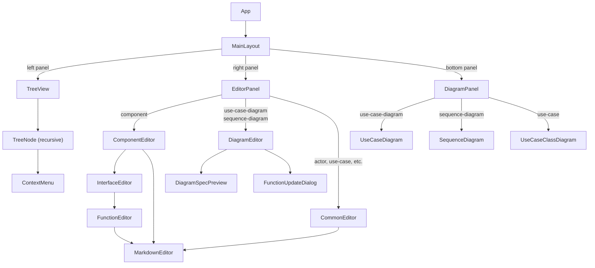
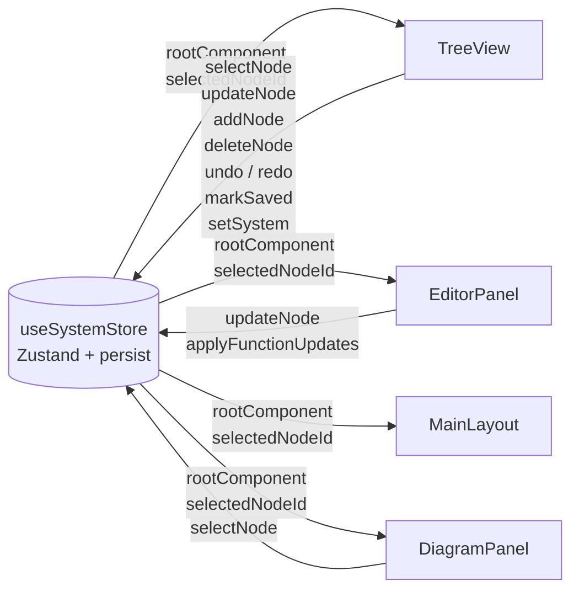

# Integra

A visual editor for system engineering models using diagram specifications.

---

## For Users

### Quick Start

#### 1. Install and run

```bash
npm install
npm run dev
```

Open [http://localhost:5173](http://localhost:5173) in your browser.

#### 2. Save and load your model

Use the **Save** / **Load** buttons in the toolbar to persist your model as a YAML file via the browser's File System Access API. Changes are also auto-saved to `localStorage` and restored on page load.

#### 3. Build your system model

The left panel shows your **system tree**. Start by renaming the root component, then add sub-components, use case diagrams, and sequence diagrams using the **+** buttons on each node.

#### 4. Write diagram specifications

Select a diagram node to open its specification editor. Type your spec in the text area — the right panel renders the diagram in real time. Syntax is highlighted as you type.

#### 5. Explore the derived model

As you write sequence diagrams, Integra automatically derives:
- **Actors and components** added to the owning component
- **Interface specifications** (with typed functions and parameters) on the receiving component
- **Use cases** listed under their use case diagram
- **Use-case class diagram** — when a use-case node is selected, the bottom panel renders an auto-generated class diagram showing all actors, components, and interfaces used across its sequence diagrams, with realization (`..|>`) and dependency (`..>`) arrows

Navigate the tree to inspect generated nodes. Clicking a node or participant in the rendered diagram navigates to that node in the tree. Orphaned nodes (no longer referenced by any diagram) show a delete button on hover.

---

### Editor Features

#### Autocomplete

The diagram spec editor provides context-aware suggestions as you type:
- **Participants**: suggest known actors and components when typing after `actor`, `component`, or `from`
- **Message receivers**: suggest participants when typing the receiver in a message line
- **UseCase targets**: suggest use case IDs after `UseCase:` in a message label

Suggestions appear in a dropdown and reflect nodes already defined in the current component (local-first ordering).

#### Keyboard Shortcuts

| Shortcut | Action |
|---|---|
| `Shift+Enter` | Save spec and preview diagram without leaving edit mode |
| `Cmd/Ctrl+Z` | Undo (diagram spec editor *or* tree-level) |
| `Cmd/Ctrl+Shift+Z` | Redo |

Tree-level undo/redo is also accessible via the toolbar buttons above the system tree.

#### Panel Layout

The split-panel layout can be adjusted by dragging the resize handles. Use the **›** button on the right-panel handle to expand/collapse the right panel.

---

### Diagram Specifications

#### Use Case Diagram

Declare actors, use cases, and their relationships.

```
actor "Customer" as customer
actor "Admin" from root/admin as admin

use case "Browse Catalogue" as browse
use case "Place Order" as order
use case "Manage Products" as manage

customer --> browse
customer --> order
admin --> manage
```

| Keyword | Purpose |
|---|---|
| `actor "Name" as id` | Declare an actor |
| `use case "Name" as id` | Declare a use case |
| `from path/to/node` | Reference an existing node instead of creating a new one |
| `A --> B` | Relationship arrow (rendered as-is by Mermaid) |

**Node IDs are scoped to the owning component.** The same ID can be reused in different components.

---

#### Sequence Diagram

Declare participants and message interactions.

```
actor "Customer" as customer
component "Order Service" as orderSvc
component "Payment Service" from payments/paymentSvc as paymentSvc

customer->>orderSvc: OrdersAPI:placeOrder(orderId: string, amount: number)
orderSvc->>paymentSvc: PaymentsAPI:charge(orderId: string, amount: number, currency: string?)
orderSvc->>customer: UseCase:orderConfirmed
```

| Syntax | Purpose |
|---|---|
| `actor "Name" as id` | Declare an actor participant |
| `component "Name" as id` | Declare a component participant |
| `from path/to/node` | Reference an existing node (no new node created) |
| `sender->>receiver: Interface:function(param: type)` | Function call message — derives interface on receiver |
| `sender->>receiver: UseCase:useCaseId` | Use case reference — links to an existing use case on the receiver |
| `sender->>receiver: UseCase:useCaseId:label` | Use case reference with a custom Mermaid message label |

**Function call message format:** `sender->>receiver: InterfaceId:functionId(param: type, param2: type?)`
- Parameter types default to `any` if omitted
- Append `?` to mark a parameter as optional (e.g. `name: string?`)
- For `kafka`-type interfaces, the **sender** owns the interface

**Self-reference:** A `component` participant with the same ID as the owning component is treated as a self-reference — no child component is created.

---

### Cross-Component References

Use the `from` clause to reference nodes defined in other parts of the tree. The path is a `/`-separated list of component IDs with the node ID last:

```
actor "Global Admin" from root/admin as admin
component "Auth Service" from services/auth as auth
```

When `from` is used, no new node is created — the existing node's UUID is recorded in `referencedNodeIds`. The node cannot be deleted while this reference exists.

---

### Markdown Descriptions

All description fields support Markdown. In preview mode, write links to other nodes using their tree path:

```markdown
See also [Login Flow](loginFlow)                          <!-- same component, bare id -->
See also [Auth Service](services/auth)                    <!-- cross-component path -->
See also [Login Use Case](services/auth/mainDiag/login)   <!-- deep path -->
```

Clicking a node link navigates to that node in the tree.

---

### YAML File Format

Integra saves and loads your model as a **YAML file** (`.yaml` / `.yml`). The file is a direct serialisation of the root `ComponentNode` tree — the same structure held in memory. It can be read, authored, or version-controlled by hand, though the app manages certain fields automatically (see notes below).

#### Top-level structure

The file root is always a `component` node representing the root of your system:

```yaml
uuid: <globally-unique-id>
id: root                      # must be "root" for the root component
name: My System
type: component
description: Optional description   # supports Markdown
subComponents: [...]
actors: [...]
useCaseDiagrams: [...]
interfaces: [...]
```

#### Node type fields

| Node type | Key fields (beyond `uuid`, `id`, `name`, `type`, `description`) |
|---|---|
| `component` | `subComponents[]`, `actors[]`, `useCaseDiagrams[]`, `interfaces[]` |
| `actor` | *(none)* |
| `use-case-diagram` | `content` (spec text), `useCases[]` |
| `use-case` | `sequenceDiagrams[]` |
| `sequence-diagram` | `content` (spec text) |

Interface specifications live directly on their owning component:

| Object | Key fields |
|---|---|
| `InterfaceSpecification` | `uuid`, `id`, `name`, `type` (`rest`\|`kafka`\|`graphql`\|`other`), `functions[]` |
| `InterfaceFunction` | `uuid`, `id`, `description?`, `parameters[]` |
| `Parameter` | `name`, `type`, `required` (boolean), `description?` |

#### Example

```yaml
uuid: a1b2c3d4-0001
id: root
name: E-Commerce System
type: component
subComponents:
  - uuid: a1b2c3d4-0010
    id: orderSvc
    name: Order Service
    type: component
    subComponents: []
    actors: []
    useCaseDiagrams: []
    interfaces:
      - uuid: a1b2c3d4-0011
        id: OrdersAPI
        name: OrdersAPI
        type: rest
        functions:
          - uuid: a1b2c3d4-0012
            id: placeOrder
            parameters:
              - name: orderId
                type: string
                required: true
              - name: amount
                type: number
                required: true
actors:
  - uuid: a1b2c3d4-0020
    id: customer
    name: Customer
    type: actor
useCaseDiagrams:
  - uuid: a1b2c3d4-0030
    id: mainFlows
    name: Main Flows
    type: use-case-diagram
    content: |
      actor "Customer" as customer
      use case "Place Order" as placeOrder
      customer --> placeOrder
    useCases:
      - uuid: a1b2c3d4-0031
        id: placeOrder
        name: Place Order
        type: use-case
        sequenceDiagrams:
          - uuid: a1b2c3d4-0040
            id: placeOrderFlow
            name: Place Order Flow
            type: sequence-diagram
            content: |
              actor "Customer" as customer
              component "Order Service" as orderSvc
              customer->>orderSvc: OrdersAPI:placeOrder(orderId: string, amount: number)
interfaces: []
```

The only field you must ensure is unique is `uuid` — use any distinct string per node (e.g. standard UUIDs or simple incrementing IDs as in the example above).

---

## For Developers

### System Requirements

Integra is a single-page web application that allows users to model software systems hierarchically. The core requirements are:

1. **Hierarchical component model** — a tree of components, each with actors, sub-components, use case diagrams, and interface specifications
2. **Use case diagrams** — text-specified diagrams that declare actors and use cases, with relationship arrows rendered via Mermaid
3. **Sequence diagrams** — text-specified interaction diagrams that automatically derive typed interface specifications on components
4. **Derived interfaces** — interface functions (with typed parameters) are extracted from sequence diagram messages and stored on the receiving component
5. **Cross-component references** — participants can reference nodes in other components via a `from path` clause; referenced nodes cannot be deleted while the reference exists
6. **Self-referencing** — a sequence diagram can declare a participant with the same id as its owning component (treated as a self-reference, not a new child)
7. **Use case references in messages** — sequence diagram messages can reference use cases on a component via `UseCase:ucId`; referenced use cases cannot be deleted
8. **Function update flow** — when a function signature changes, the user is prompted to update all affected sequence diagrams or add an overload
9. **Orphan detection** — actors and components not referenced by any diagram are deletable; otherwise the delete button is hidden
10. **Syntax highlighting** — the diagram specification editor highlights known tokens (keywords, participants, interfaces, functions, use case references) in real time using a backdrop technique
11. **Navigation** — highlighted tokens in the specification editor are clickable and navigate to the corresponding node in the tree; entities in the rendered Mermaid diagram are also clickable for the same purpose
12. **Persistence** — system state is persisted to `localStorage` and restored on page load; a clear button resets to the initial state; Save / Load buttons use the File System Access API to read/write YAML files
13. **Auto-generated use-case class diagram** — selecting a use-case node renders a class diagram in the bottom panel derived from all its sequence diagrams, showing actors, components, interfaces (with methods), and realization / dependency relationships

---

### Design Overview

#### React Component Architecture

The UI is split into three panels managed by `MainLayout`. Each panel is independently scrollable and resizable via drag handles.



**Panel roles:**

| Component | Role |
|---|---|
| `MainLayout` | Split-panel layout with draggable resize handles and expand/collapse buttons |
| `TreeView` | System tree with add/delete/rename; Save, Load, Clear, Undo/Redo toolbar |
| `TreeNode` | Recursive node row — renders label, type icon, +/delete buttons, selection highlight |
| `ContextMenu` | Right-click menu for node-level actions |
| `EditorPanel` | Routes to the correct editor based on the selected node's type |
| `DiagramEditor` | Text editor for use-case and sequence diagram specs; syntax highlighting, autocomplete, undo/redo, Shift+Enter save |
| `DiagramSpecPreview` | Read-only highlighted view of a spec; used in both `"backdrop"` mode (behind the textarea) and `"preview"` mode (standalone) |
| `ComponentEditor` | Name, description, and interface list editor for component nodes |
| `InterfaceEditor` | Interface name, type, and function list editor |
| `FunctionEditor` | Function id, parameters, and description editor; shows referencing sequence diagrams |
| `CommonEditor` | Minimal name + markdown description editor for actor, use-case, and sequence-diagram nodes |
| `MarkdownEditor` | Markdown textarea with preview toggle; node-path links are clickable |
| `FunctionUpdateDialog` | Modal dialog shown when a function signature change affects other diagrams |
| `DiagramPanel` | Routes to the correct Mermaid renderer based on selected node type |
| `UseCaseDiagram` | Renders use-case-diagram spec via Mermaid; clickable entities |
| `SequenceDiagram` | Renders sequence diagram spec via Mermaid; clickable participants and message labels |
| `UseCaseClassDiagram` | Renders auto-generated class diagram for a use-case node; clickable classes |
| `DiagramErrorBanner` | Displays Mermaid render errors with the raw spec source |

#### Hooks

Rendering logic for Mermaid diagrams is extracted into custom hooks to keep components thin:

| Hook | Used by | Purpose |
|---|---|---|
| `useMermaidBase` | `useUseCaseDiagram`, `useSequenceDiagram` | Shared Mermaid render loop — builds the diagram string, calls `mermaid.render()`, binds click handlers, exposes `svg`/`error`/`elementRef` |
| `useUseCaseDiagram` | `UseCaseDiagram` | Builds the use-case diagram transform and wires `__integraNavigate` |
| `useSequenceDiagram` | `SequenceDiagram` | Builds the sequence diagram transform and wires `__integraNavigate` |
| `useUseCaseClassDiagram` | `UseCaseClassDiagram` | Calls `buildUseCaseClassDiagram()`, renders via Mermaid, wires `__integraNavigate` |
| `useAutoComplete` | `DiagramEditor` | Cursor-position-aware suggestion engine — returns suggestions, selected index, and accept/dismiss handlers |

#### State Management

All application state lives in a single **Zustand** store (`useSystemStore`). Components subscribe selectively to avoid unnecessary re-renders.



Key store slices:

| Slice | Type | Purpose |
|---|---|---|
| `rootComponent` | `ComponentNode` | Entire system tree |
| `selectedNodeId` | `string \| null` | Currently selected node UUID |
| `savedSnapshot` | `string \| null` | YAML snapshot at last save (for unsaved-changes detection) |
| `past` / `future` | `ComponentNode[]` | Undo/redo history stacks |

#### Node Types

| Type | Parent | Auto-created? | Contains |
|---|---|---|---|
| `component` | `component` | Yes (from seq diagram) | actors, subComponents, useCaseDiagrams, interfaces |
| `actor` | `component` | Yes (from diagrams) | — |
| `use-case-diagram` | `component` | No | useCases |
| `use-case` | `use-case-diagram` | Yes (from UC diagram) | sequenceDiagrams |
| `sequence-diagram` | `use-case` | No | — |

#### Auto-generated Use-Case Class Diagram

When a `use-case` node is selected, `buildUseCaseClassDiagram()` (`src/utils/useCaseClassDiagram.ts`) parses all sequence diagrams under it and produces a Mermaid `classDiagram`:

- Each actor/component participant becomes a class node (`<<actor>>` annotation for actors)
- Each interface ID referenced in a message becomes a class with `<<interface>>` and its called methods listed
- `Component ..|> Interface` — realization (component owns/provides the interface)
- `Sender ..> Interface` — dependency (sender calls via the interface)
- `Sender ..> Receiver` — dependency for plain (non-interface, non-self) messages
- Click handlers use `globalThis.__integraNavigate` to navigate to the clicked node

#### Key Fields on `DiagramNode`

- `ownerComponentUuid` — the component that logically owns the diagram (set when created)
- `referencedNodeIds` — UUIDs of all actors/components/use-cases referenced in the diagram spec
- `referencedFunctionUuids` — UUIDs of all interface functions referenced in the diagram spec

#### Data Flow

```
User types spec
     │
     ▼
updateNode(diagramUuid, { content })
     │
     ├─► parseUseCaseDiagram()    (for use-case-diagram)
     │         └─► upsertTree() — adds actors, use cases to owning component
     │
     └─► parseSequenceDiagram()   (for sequence-diagram)
               ├─► applyParticipantsToComponent() — adds actors/components
               ├─► applyMessageToComponents() — derives interface functions
               └─► upsertTree() — stores referencedNodeIds, referencedFunctionUuids
```

#### Interface Derivation

Each `sender->>receiver: InterfaceId:functionId(...)` message:
1. Finds or creates an `InterfaceSpecification` with `id = InterfaceId` on the receiver (or sender for `kafka`)
2. Finds or creates a function with `id = functionId` and the parsed parameter list
3. If a function with the same id already exists with a **different** parameter count or types, the user is prompted via a dialog to update all affected diagrams or add as overload

#### Deletion Guards

- **Actors / components**: deletable only when `isNodeOrphaned()` returns `true` — i.e., the node's UUID appears in no `referencedNodeIds` anywhere in the full tree
- **Use cases**: deletable only when `isUseCaseReferenced()` returns `false` — same full-tree search
- `isNodeOrphaned` delegates to `isUseCaseReferenced` for a unified implementation

#### Syntax Highlighting (Backdrop Technique)

The spec editor overlays a transparent `<textarea>` on top of a non-interactive `DiagramSpecPreview` (mode `"backdrop"`). The textarea uses `text-transparent caret-white` so the coloured tokens from the backdrop show through. An `onScroll` handler keeps the two layers in sync.

#### Tech Stack

| Tool | Version | Role |
|---|---|---|
| React | 19 | UI |
| TypeScript | 5.9 | Type safety |
| Vite | 7 | Build tooling |
| Zustand | — | State management |
| Mermaid | — | Diagram rendering |
| Tailwind CSS | — | Styling |
| @uiw/react-md-editor | — | Markdown description fields |
| Vitest | 4 | Unit tests |
| Playwright | — | End-to-end tests |
| ESLint | 9 | Linting |

#### Scripts

```bash
npm run dev        # Development server
npm run build      # Production build
npm run preview    # Preview production build
npm run lint       # Run ESLint
npm test           # Run unit tests in watch mode
npm run test:run   # Run unit tests once (CI)
npm run test:ui    # Run unit tests with Vitest UI
npm run test:e2e   # Run Playwright end-to-end tests
```

