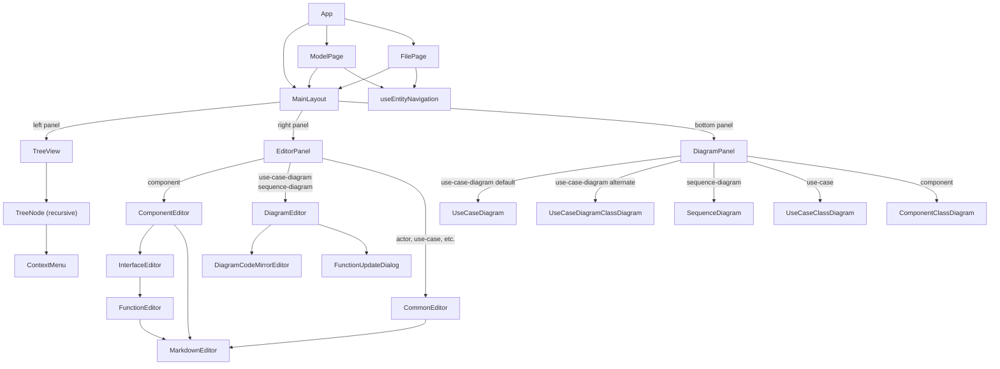
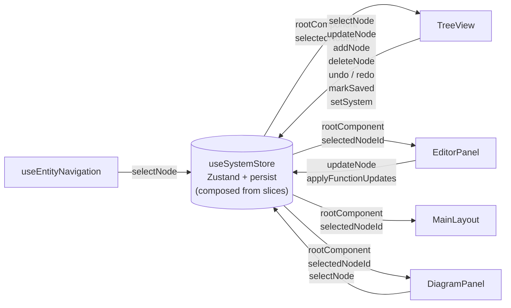
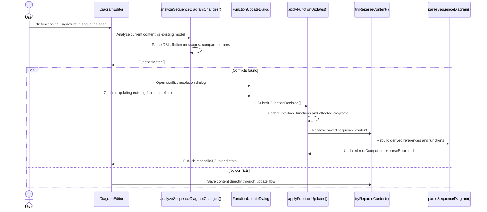
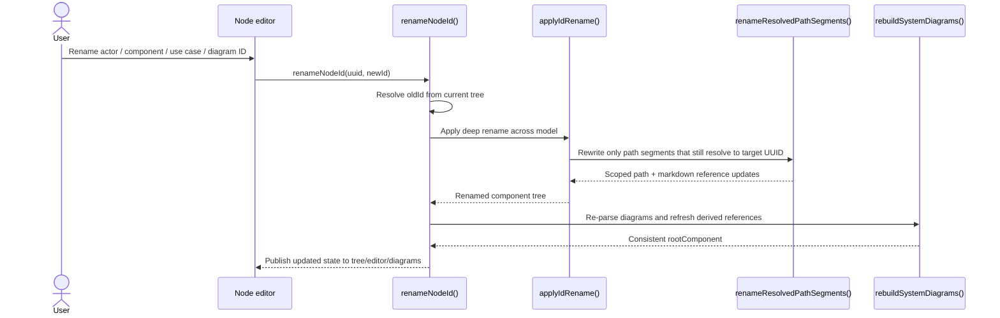
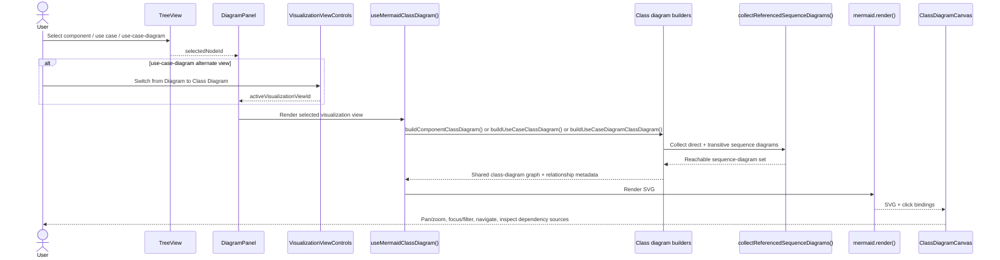

# Integra Developer Guide

Contributor-focused architecture, invariants, and implementation notes for Integra.

### System Requirements

Integra is a single-page web application that allows users to model software systems hierarchically. The core requirements are:

1. **Hierarchical component model** — a tree of components, each with actors, sub-components, use case diagrams, and interface specifications
2. **Use case diagrams** — text-specified diagrams that declare actors and use cases, with relationship arrows rendered via Mermaid
3. **Sequence diagrams** — text-specified interaction diagrams that automatically derive typed interface specifications on components
4. **Derived interfaces** — interface functions (with typed parameters) are extracted from sequence diagram messages and stored on the receiving component
5. **Cross-component references** — participants can reference nodes in other components by path; if the target node does not exist it is auto-created (including intermediate missing components); referenced nodes cannot be deleted while the reference exists
6. **Self-referencing** — a sequence diagram can declare a participant with the same id as its owning component (treated as a self-reference, not a new child)
7. **Use case references in messages** — sequence diagram messages can reference use cases via `UseCase:ucId` (local) or `UseCase:path/to/comp/ucId` (cross-component); referenced use cases cannot be deleted
8. **Block constructs** — sequence diagrams support `loop`, `alt`/`else`, `opt`, and `par`/`and` structural blocks (fully nestable); interface specs are derived from messages at any nesting depth
9. **Function update flow** — when a function signature changes, the user is prompted to update all affected sequence diagrams or add an overload
9. **Orphan detection** — actors and components not referenced by any diagram are deletable; otherwise the delete button is hidden
10. **Syntax highlighting** — the diagram specification editor (CodeMirror 6) highlights known tokens (keywords, participants, interfaces, functions, use case references) in real time using a Chevrotain-based decoration pass
11. **Navigation** — highlighted tokens in the specification editor are clickable and navigate to the corresponding node in the tree; entities in the rendered Mermaid diagram are also clickable for the same purpose; entity selection is reflected in the browser URL so entities can be bookmarked and linked directly; browser back/forward navigate through the entity selection history
12. **Persistence** — system state is persisted to `localStorage` and restored on page load; a clear button resets to the initial state; Save / Load buttons use the File System Access API to read/write YAML files
13. **Auto-generated use-case class diagram** — selecting a use-case node renders a class diagram in the bottom panel derived from all its sequence diagrams plus transitively referenced `Sequence:` and `UseCase:` targets, showing actors, components, interfaces (with methods), and realization / dependency relationships; repeated reachable diagrams are deduplicated and circular references are ignored after the first visit. Messages whose arrows are prefixed with `X` are skipped when deriving dependencies
14. **Auto-generated component class diagram** — selecting a component node renders a class diagram showing: the component's own interfaces (with method signatures, filtered to only the methods actually called in diagrams when those interfaces participate in derived dependencies); sibling actors/components that call those interfaces (dependents); sibling components that this component calls out to (dependencies); and dependency interfaces derived from nested calls without rendering the selected component's own sub-components as separate classes; with distinct colors for the subject component and its own interfaces; when the root component is selected, shows direct root children, participating root actors, and relationships between them, including dependencies rolled up from nested descendants. Dependency derivation follows transitively referenced `Sequence:` and `UseCase:` targets with deduplication and cycle protection, and ignores messages whose arrows are prefixed with `X`

---

### Design Overview

#### Model Invariants

The core model is intentionally split between a **stored write model** and a
**resolved read model**. Contributors should preserve that split by using the
shared helpers below instead of reaching into nested fields directly.

| Invariant | What it means | Use these helpers |
|---|---|---|
| Inherited interfaces resolve their contract from the full inherited chain + child-local additions | An inherited `InterfaceSpecification` stores child-local added functions in `functions`, while read paths resolve the effective contract by recursively following inherited parent interfaces and merging that result with the local additions | `isInheritedInterface()`, `isLocalInterface()`, `getStoredInterfaceFunctions()`, `resolveEffectiveInterfaceFunctions()`, `resolveInterface()` in `src/utils/interfaceFunctions.ts` |
| Function IDs are unique within each interface | A single interface cannot store two functions with the same `id`; a signature change updates the existing function instead of creating an overload-like sibling entry | `classifyFunctionCompatibility()` in `src/utils/interfaceFunctions.ts`, the parser/update flow in `src/parser/sequenceDiagram/systemUpdater.ts`, and `applyFunctionUpdates()` |
| Components are updated immutably and kept in canonical order | Updates should return new objects, not mutate nested arrays, and interface/function ordering should stay normalized | `normalizeComponent()`, `normalizeComponentDeep()`, `updateFunctionParams()`, `removeFunctionsFromInterfaces()` in `src/nodes/interfaceOps.ts` |
| Parent functions remain authoritative while child-local inherited functions are additive | Child-added functions may exist on inherited interfaces, but they cannot reuse a parent function ID; exact matches are removed explicitly through the conflict-resolution flow | `findInheritedParentFunction()`, `findInheritedParentFunctionById()`, `findConflictingInheritedChildFunctions()`, the parser/update flow in `src/parser/sequenceDiagram/systemUpdater.ts`, and `applyFunctionUpdates()` |
| Reparsing sequence diagrams must preserve user-authored metadata | Rebuilding functions from diagram text should keep descriptions and parameter metadata where possible | `tryReparseContent()` in `src/store/systemOps.ts` |
| Runtime boundaries validate and normalize model data before it enters the app state | Persisted YAML / `localStorage` data should be parsed through the schema layer, not trusted as-is | `parseComponentNode()`, `safeParseComponentNode()`, `safeParsePersistedSystemState()` in `src/store/modelSchema.ts` |
| Cross-component references must stay within the supported scope rules | Diagram references are only valid for the owning component, its descendants, its ancestors, and direct children of those ancestors | `isInScope()` in `src/utils/nodeUtils.ts` |

#### Which helper should I use?

- **Reading interface functions for rendering, lookup, or validation:** use
  `resolveEffectiveInterfaceFunctions()` or `resolveInterface()`. Do **not**
  assume `iface.functions` is the readable contract for inherited interfaces.
- **Reading only locally stored functions during an edit operation:** use
  `getStoredInterfaceFunctions()`. For inherited interfaces, this returns the
  child-local additions rather than the full effective contract.
- **Adding/removing/updating functions on a component:** use the helpers in
  `src/nodes/interfaceOps.ts`, then normalize with `normalizeComponent()`
  where appropriate instead of mutating `component.interfaces` in place.
- **Reparsing diagram text back into the model tree:** use
  `tryReparseContent()` so function descriptions and parameter metadata are
  preserved across parser rebuilds.
- **Accepting data from persistence or imports:** go through
  `safeParsePersistedSystemState()` / `parseComponentNode()` instead of casting
  unknown data to the model types.
- **Checking whether a diagram may reference another component:** use
  `isInScope()` rather than hand-rolling ancestor/sibling checks.

#### Examples

**Read the effective contract for inherited interfaces**

```ts
// Bad: inherited interfaces may store only child-local additions
const functions = iface.functions

// Good: resolve the readable contract from the inherited chain plus child-local additions
const functions = resolveEffectiveInterfaceFunctions(iface, ownerComp, rootComponent)
```

**Detect redundant inherited child-local functions**

```ts
const inheritedParentFn = findInheritedParentFunction(
  currentInterface,
  ownerComponent,
  rootComponent,
  functionId,
  newParams,
)

if (inheritedParentFn) {
  // Prompt the user to remove the redundant child-local function,
  // or reject the change if they cancel.
}
```

**Preserve immutability and canonical ordering**

```ts
// Bad: mutates nested state and bypasses sorting rules
component.interfaces.push(newInterface)

// Good: return a new component value and normalize its ordering
const next = normalizeComponent({
  ...component,
  interfaces: [...component.interfaces, newInterface],
})
```

**Preserve user-authored metadata when reparsing sequence diagrams**

```ts
const result = tryReparseContent(content, system, nodeUuid)
if (!result.parseError) {
  updateSystem(result.rootComponent)
}
```

When in doubt, prefer the shared helper that already exists in the store,
parser, or node utility layer. Most of the subtle model bugs in this codebase
come from bypassing one of these invariants.

#### React Component Architecture

The UI is split into three panels managed by `MainLayout`. Each panel is independently scrollable and resizable via drag handles.



**Panel roles:**

| Component | Role |
|---|---|
| `ModelPage` | Loads a model from the web server at `/models/<id>/root.yaml`; mounts `useEntityNavigation`; shows 404 if model not found |
| `FilePage` | Handles `/file/...` routes; prompts to load a filesystem model if none is present; mounts `useEntityNavigation` |
| `MainLayout` | Split-panel layout with draggable resize handles and expand/collapse buttons |
| `TreeView` | System tree with add/delete/rename; Save, Load, Clear, Undo/Redo toolbar; Integra app icon in header |
| `TreeNode` | Recursive node row — renders label, type icon, +/delete buttons, selection highlight |
| `ContextMenu` | Right-click menu for node-level actions |
| `EditorPanel` | Routes to the correct editor based on the selected node's type |
| `DiagramEditor` | Text editor for use-case and sequence diagram specs; syntax highlighting, autocomplete, undo/redo, Shift+Enter save |
| `DiagramCodeMirrorEditor` | CodeMirror 6 editor wrapper used by `DiagramEditor`; handles both editable and read-only (preview) modes; Chevrotain-powered syntax highlighting; click-to-navigate tokens in preview mode |
| `ComponentEditor` | Name, description, and interface list editor for component nodes; "Inherit parent interface" selector above tabs for sub-components |
| `InterfaceEditor` | Interface name, type, and function list editor |
| `FunctionEditor` | Function id, parameters, and description editor; shows referencing sequence diagrams |
| `CommonEditor` | Minimal name + markdown description editor for actor, use-case, and sequence-diagram nodes |
| `MarkdownEditor` | Markdown textarea with preview toggle; node-path links are clickable |
| `FunctionUpdateDialog` | Modal dialog shown when a function signature change affects other diagrams |
| `DiagramPanel` | Routes to the correct visualization view based on the selected node type and active panel view |
| `UseCaseDiagram` | Renders use-case-diagram spec via Mermaid; clickable entities |
| `UseCaseDiagramClassDiagram` | Renders the generated class diagram for a use-case-diagram node by aggregating all child use cases |
| `SequenceDiagram` | Renders sequence diagram spec via Mermaid; clickable participants and message labels |
| `UseCaseClassDiagram` | Renders auto-generated class diagram for a use-case node; clickable classes |
| `ComponentClassDiagram` | Renders auto-generated class diagram for a component node showing its interfaces and dependents (callers) and dependencies (outgoing calls to other components); clickable classes |
| `DiagramErrorBanner` | Displays Mermaid render errors with the raw spec source |

#### Hooks

Rendering logic for Mermaid diagrams is extracted into custom hooks to keep components thin:

| Hook | Used by | Purpose |
|---|---|---|
| `useMermaidBase` | `useUseCaseDiagram`, `useSequenceDiagram` | Shared Mermaid render loop — builds the diagram string, calls `mermaid.render()`, binds click handlers, exposes `svg`/`error`/`elementRef` |
| `useUseCaseDiagram` | `UseCaseDiagram` | Builds the use-case diagram transform and wires `__integraNavigate` |
| `useSequenceDiagram` | `SequenceDiagram` | Builds the sequence diagram transform and wires `__integraNavigate` |
| `useMermaidClassDiagram<T>` | `useUseCaseClassDiagram`, `useUseCaseDiagramClassDiagram`, `useComponentClassDiagram` | Generic shared hook — accepts a `buildFn(node, rootComponent)` and an `idPrefix`; handles Mermaid render, click binding, error state, and the per-instance `idToUuidRef` (eliminates the `__integraIdMap` global) |
| `useUseCaseClassDiagram` | `UseCaseClassDiagram` | Thin wrapper: calls `useMermaidClassDiagram(buildUseCaseClassDiagram, node, "uc-class")` |
| `useUseCaseDiagramClassDiagram` | `UseCaseDiagramClassDiagram` | Thin wrapper: calls `useMermaidClassDiagram(buildUseCaseDiagramClassDiagram, node, "uc-diagram-class")` |
| `useComponentClassDiagram` | `ComponentClassDiagram` | Thin wrapper: calls `useMermaidClassDiagram(buildComponentClassDiagram, node, "comp-class")` |
| `useAutoComplete` | `DiagramEditor` / `integraAutocomplete.ts` | Thin React hook — wires cursor position to suggestion results; pure logic (`detectContext`, `buildSuggestions`, etc.) lives in `autoCompleteLogic.ts` |
| `useEntityNavigation` | `ModelPage`, `FilePage` | Syncs `selectedNodeId` ↔ browser URL via `history.pushState`; handles `popstate` for browser back/forward; resolves entity path on initial mount |

#### State Management

All application state lives in a single **Zustand** store (`useSystemStore`). Components subscribe selectively to avoid unnecessary re-renders. The store is composed from four slice files:

```
src/store/
  useSystemStore.ts         ← composes slices + persist middleware (~60 lines)
  systemOps.ts              ← pure helpers: rebuildSystemDiagrams, tryReparseContent,
                               stripExclusiveFunctionContributions (independently testable)
  slices/
    historySlice.ts         ← past, future, undo, redo
    uiSlice.ts              ← selectedNodeId, parseError, savedSnapshot, selectNode, markSaved
    nodeOpsSlice.ts         ← addNode, updateNode, deleteNode, renameNodeId
    diagramSlice.ts         ← setSystem, clearSystem, applyFunctionUpdates
```



Key state fields:

| Field | Type | Slice | Purpose |
|---|---|---|---|
| `rootComponent` | `ComponentNode` | top-level | Entire system tree |
| `selectedNodeId` | `string \| null` | `uiSlice` | Currently selected node UUID |
| `savedSnapshot` | `string \| null` | `uiSlice` | YAML snapshot at last save (for unsaved-changes detection) |
| `past` / `future` | `ComponentNode[]` | `historySlice` | Undo/redo history stacks |

> **Navigation history** is no longer stored in the Zustand store. Browser history entries are created by `useEntityNavigation` via `history.pushState` on each entity selection, so browser back/forward navigate through entity selections natively.

#### Node Types

| Type | Parent | Auto-created? | Contains |
|---|---|---|---|
| `component` | `component` | Yes (from seq diagram) | actors, subComponents, useCaseDiagrams, interfaces |
| `actor` | `component` | Yes (from diagrams) | — |
| `use-case-diagram` | `component` | No | useCases |
| `use-case` | `use-case-diagram` | Yes (from UC diagram) | sequenceDiagrams |
| `sequence-diagram` | `use-case` | No | — |

#### Auto-generated Use-Case Class Diagram

When a `use-case` node is selected, `buildUseCaseClassDiagram()` (`src/utils/useCaseClassDiagram.ts`) builds the same shared class-diagram graph used by the other generated class-diagram views:

- Starts from the use case's own sequence diagrams, then follows referenced `Sequence:` and `UseCase:` targets transitively with deduplication and cycle protection
- Uses the owning component as the visibility boundary
- Shows only in-scope components plus the interfaces owned by those visible components
- Folds dependencies from out-of-scope descendants to the closest visible ancestor
- Supports the shared `Interfaces` toggle plus single-click focus / double-click navigation behavior

#### Auto-generated Component Class Diagram

When a `component` node is selected, `buildComponentClassDiagram()` (`src/utils/componentClassDiagram.ts`) uses that component as both the owner boundary and the default highlighted subject:

- Starts from sequence diagrams owned under the selected component (or the full system when the selected component is the root), then follows referenced diagrams transitively
- Shows the selected component itself plus any visible in-scope actors, components, and dependency-participating interfaces
- Highlights the selected component and its interfaces by default
- Folds deeper descendants to their closest visible direct child / in-scope ancestor component
- Reuses the same interface toggle, focus filter, and double-click navigation model as the other generated class diagrams

The **visible-participant restriction** is the key scoping rule: the diagram stays at one visible level at a time. It shows the subject, its direct siblings, and—when nested activity needs to be surfaced—rolled-up direct children of the selected component. It does not expose arbitrary deep descendants of sibling or ancestor-sibling components.

Example output for `orderSvc` (provides `OrdersAPI`, called by `client`, depends on `paymentSvc.PaymentsAPI`):
```
classDiagram
    class orderSvc["Order Service"]
    class OrdersAPI {
        <<interface>>
        +placeOrder(orderId: string, amount: number)
    }
    orderSvc ..|> OrdersAPI
    class client["Client"]
    client ..> OrdersAPI
    class PaymentsAPI {
        <<interface>>
        +charge(orderId: string, amount: number)
    }
    class paymentSvc["Payment Service"]
    paymentSvc ..|> PaymentsAPI
    orderSvc ..> PaymentsAPI
    click orderSvc call __integraNavigate("orderSvc")
    click client call __integraNavigate("client")
    click paymentSvc call __integraNavigate("paymentSvc")
    style orderSvc fill:#1d4ed8,stroke:#1e3a5f,color:#ffffff
    style OrdersAPI fill:#bfdbfe,stroke:#2563eb,color:#1e3a5f
```

#### Parsers (`src/parser/`)

Diagram specs are parsed by **Chevrotain**-based lexer + CstParser + CST visitor pipelines, one per diagram type:

```
src/parser/
  tokens.ts                     ← shared token definitions
  sequenceDiagram/
    lexer.ts                    ← multi-mode lexer; Indent token (line-start whitespace) and Comment token (# prefix)
    parser.ts                   ← CstParser
    visitor.ts                  ← CST → SeqAst { declarations[], statements[] }
                                   statement types carry optional `indent?: string`; SeqComment preserves # lines
    systemUpdater.ts            ← SeqAst → node tree update
    mermaidGenerator.ts         ← SeqAst → Mermaid string + idToUuid map (uses nodeTree, not store)
    specSerializer.ts           ← SeqAst → spec text; AST-aware ID rename; reproduces original indentation and comments
  useCaseDiagram/
    lexer.ts                    ← single-mode lexer
    parser.ts                   ← CstParser
    visitor.ts                  ← CST → UcdAst { declarations[], links[] }
    systemUpdater.ts            ← UcdAst → node tree update
    mermaidGenerator.ts         ← UcdAst → Mermaid string + idToUuid map (uses nodeTree, not store)
    specSerializer.ts           ← UcdAst → spec text; AST-aware ID rename
```

The `mermaidGenerator` files are pure (no store imports) — they accept a `root: ComponentNode` and produce a Mermaid string using `findNodeByUuid` from `src/nodes/nodeTree` directly.

#### Node Tree (`src/nodes/`)

The component tree is managed through a typed dispatch layer:

```
src/nodes/
  nodeTree.ts             ← generic tree ops (upsert, delete, find, collect) via NodeHandler dispatch
  nodeHandler.ts          ← NodeHandler interface
  componentNode.ts        ← componentHandler + re-exports from split modules
  componentCRUD.ts        ← component/actor factory and structural mutation helpers
  componentTraversal.ts   ← read-only search: findCompByUuid, findParent, getSiblingIds, etc.
  interfaceOps.ts         ← interface/function mutations: addFunction, updateParams, removeFunctions
  useCaseDiagramNode.ts   ← ucDiagHandler
  useCaseNode.ts          ← useCaseHandler
  sequenceDiagramNode.ts  ← leaf handler + replaceSignatureInContent
  actorNode.ts            ← leaf handler
```

`nodeHandlers: Record<Node["type"], NodeHandler>` enforces exhaustiveness at compile time — adding a new node type without registering a handler is a TypeScript error.

`SeqAst.statements` preserves source order for both messages and notes, so notes appear in the rendered diagram exactly where they were written.

**Node ID renaming** uses an AST-aware parse → rename → serialize round-trip (`specSerializer.ts`) rather than regex replacement. This correctly handles IDs that contain hyphens (e.g. `api-gateway`) which a word-boundary regex would corrupt.

**Parsed-AST caching**: `src/utils/seqAstCache.ts` provides a module-level `Map<content, SeqAst>` cache used by the class diagram builders. The same sequence diagram content is never re-parsed more than once per session, avoiding redundant Chevrotain full-parses on every React render.

- `ownerComponentUuid` — the component that logically owns the diagram (set when created)
- `referencedNodeIds` — UUIDs of all actors/components/use-cases referenced in the diagram spec
- `referencedFunctionUuids` — UUIDs of all interface functions referenced in the diagram spec

#### Data Flow

```
User types spec
     │
     ▼
updateNode(diagramUuid, { content })
     │
     ├─► parseUseCaseDiagram()    (for use-case-diagram)
     │         └─► upsertTree() — adds actors, use cases to owning component
     │
     └─► parseSequenceDiagram()   (for sequence-diagram)
               ├─► applyParticipantsToComponent() — adds actors/components
               ├─► applyMessageToComponents() — derives interface functions
               └─► upsertTree() — stores referencedNodeIds, referencedFunctionUuids
```

Both parsers are implemented with **Chevrotain** (lexer + CstParser + CST visitor), producing typed ASTs (`SeqAst` / `UcdAst`) before applying node-tree changes or generating Mermaid output. Parse errors are reported with line and column numbers and cleared automatically when the content becomes valid.

#### Interface Derivation

Each `sender ->> receiver: InterfaceId:functionId(...)` message:
1. Finds or creates an `InterfaceSpecification` with `id = InterfaceId` on the receiver (or sender for `kafka`)
2. Finds or creates a function with `id = functionId` and the parsed parameter list
3. If a function with the same id already exists with a **different** signature, the user is prompted via a dialog to update the existing function definition and any affected diagrams
4. Function IDs are unique within an interface, so sequence-diagram edits no longer create overload-like sibling definitions with the same ID
5. If the interface has `parentInterfaceUuid` set (**inherited interface**), exact parent matches continue using the inherited parent function, while only new function IDs are stored as child-local additions on the inherited interface
6. If a child-local inherited function becomes identical to the parent, or a parent change would become identical to child-local inherited functions, the user is prompted to confirm removing the redundant child-local functions; otherwise the change is rejected

#### Interface Inheritance (view-layer class)

Inheritance is stored as a single `parentInterfaceUuid?: string` field on `InterfaceSpecification`. Functions on an inherited interface store only the child-local additions; the effective readable contract is resolved by combining those stored functions with the parent's functions.

The `InheritedInterface` class (`src/components/editor/InheritedInterface.ts`) is a view-layer wrapper constructed at React render time only — never stored in Zustand or serialized:

```typescript
class InheritedInterface implements InterfaceSpecification {
  get functions() { return this.parentIface.functions }  // reads from parent
  set functions(_) {}  // no-op — prevents assignment errors from React internals
}
```

`ComponentEditor` wraps stored plain-object interfaces in `InheritedInterface` when `parentInterfaceUuid` is set, so all downstream components (`InterfaceEditor`, `FunctionEditor`) receive the parent's functions transparently. **The class is never spread, stringified, or stored** — Zustand state always holds plain objects.

#### Deletion Guards

- **Actors / components**: deletable only when `isNodeOrphaned()` returns `true` — i.e., the node's UUID appears in no `referencedNodeIds` anywhere in the full tree
- **Use cases**: deletable only when `isUseCaseReferenced()` returns `false` — same full-tree search
- `isNodeOrphaned` delegates to `isUseCaseReferenced` for a unified implementation

#### Syntax Highlighting (CodeMirror 6 + Chevrotain)

The spec editor uses **CodeMirror 6** (`DiagramCodeMirrorEditor`) for both editable and read-only preview modes.  Syntax colouring is provided by a CodeMirror `StateField<DecorationSet>` in `integraLanguage.ts` that runs line-by-line regex tokenisation (identical patterns to the former backdrop approach) on every document change and maps token types to `Decoration.mark({ class })` spans.  The same pass also builds a navigation map (offset range → node UUID) used by the readonly editor to navigate the tree on token click.

Chevrotain lexer tokens defined in `src/parser/tokens.ts` are the authoritative token vocabulary; the CM highlight field follows the same pattern rules to keep behaviour in sync.

Autocomplete is provided by `integraAutocomplete.ts`, a CodeMirror `CompletionSource` that delegates to the pure functions `detectContext` / `buildSuggestions` exported from `autoCompleteLogic.ts`. The React hook `useAutoComplete` is a thin wrapper that wires cursor position to those pure functions; `integraAutocomplete.ts` calls them directly without going through the hook. CodeMirror manages the trigger delay and dropdown UI.

#### Architecturally Significant Flows

The following sequence diagrams highlight the main runtime loops that make
Integra more than a static diagram editor. They focus on the paths where UI
actions trigger parsing, store reconciliation, reference maintenance, and
derived visualization generation.

##### 1. Function parameter change → conflict detection → propagated updates

This is the core "diagram text drives the model" flow for sequence diagrams.



- `DiagramEditor` calls `analyzeSequenceDiagramChanges()` before saving changed
  sequence content.
- If a signature change would affect referenced functions elsewhere, the editor
  pauses and opens `FunctionUpdateDialog` instead of silently mutating the
  model.
- `applyFunctionUpdates()` updates both interface definitions and any affected
  sequence-diagram text, then runs `tryReparseContent()` so the stored model and
  derived references stay aligned.

##### 2. Node rename / ID rename → scoped reference updates

This flow explains how Integra preserves reference integrity when IDs change.



- `renameNodeId()` does not perform a raw text replacement; it delegates to
  `applyIdRename()` and scoped path-resolution helpers so only references that
  still resolve to the renamed target are rewritten.
- Markdown node-path links and diagram-path references are updated together,
  which keeps descriptions and specs synchronized.
- `rebuildSystemDiagrams()` runs after the rename so `referencedNodeIds`,
  `referencedFunctionUuids`, and other derived fields reflect the new IDs.

##### 3. Generated class diagram flow for use-case, use-case-diagram, and component views

This is the runtime path from authored diagrams to derived visualizations in the
bottom panel.



- `DiagramPanel` now uses a generic per-node-type view model, so a node can
  expose more than one visualization without hard-coding new panel branches.
- `buildUseCaseDiagramClassDiagram()` reuses the same shared graph builder as
  the other generated class diagrams, but starts from all use cases under the
  selected use-case diagram.
- All generated class diagrams flow through `useMermaidClassDiagram()`, which
  centralizes Mermaid rendering, single-click focus filtering, double-click
  navigation, and relationship popup wiring.
- `DiagramPanel` owns the visualization-only `Interfaces` toggle state and
  passes it into the generated class-diagram hooks so the stored component and
  interface model stays unchanged.

#### Tech Stack

| Tool | Version | Role |
|---|---|---|
| React | 19 | UI |
| TypeScript | 5.9 | Type safety |
| Vite | 7 | Build tooling |
| Zustand | — | State management |
| Mermaid | — | Diagram rendering |
| Chevrotain | 11 | Lexer + parser for diagram spec grammars |
| Tailwind CSS | — | Styling |
| CodeMirror 6 | — | Diagram spec editor (syntax highlighting, autocomplete, undo/redo) |
| Chevrotain | 11 | Diagram spec lexer / parser; token vocabulary reused for CM highlighting |
| @uiw/react-md-editor | — | Markdown description fields |
| Vitest | 4 | Unit tests |
| Playwright | — | End-to-end tests |
| ESLint | 9 | Linting |

#### Scripts

```bash
npm run dev        # Development server
npm run build      # Production build
npm run preview    # Preview production build
npm run lint       # Run ESLint
npm test           # Run unit tests in watch mode
npm run test:run   # Run unit tests once (CI)
npm run test:ui    # Run unit tests with Vitest UI
npm run test:e2e   # Run Playwright end-to-end tests
```
